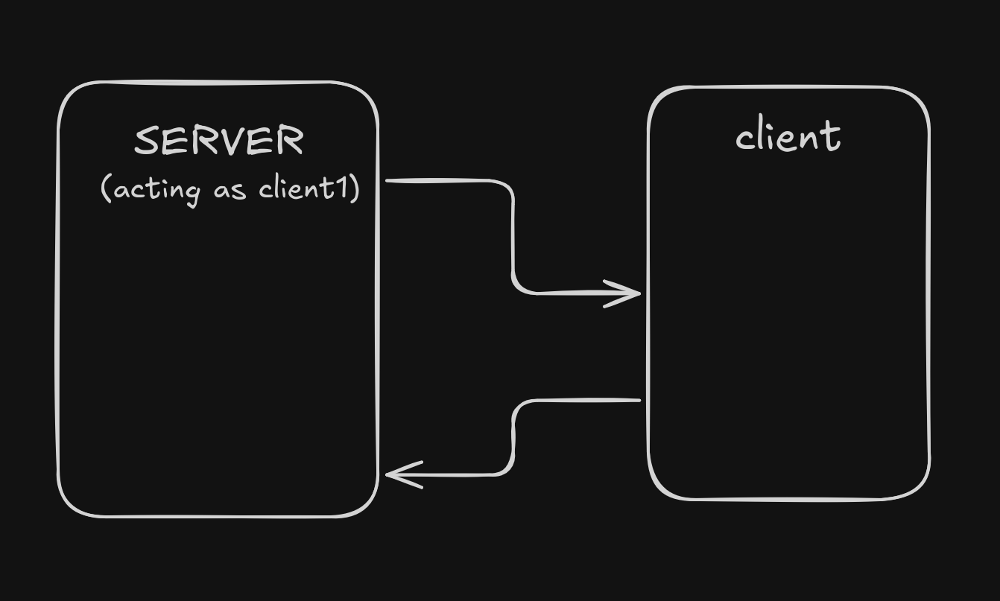

# CLI based Chat Application

## Implemented in C language

This project demonstrates socket programming in C through two stages:

1. One-to-One Communication (basic client-server)
2. Group Chat System (multi-client using select())

- one-to-one/ → basic communication between server and single client
- group-chat/ → multi-client chat server with broadcasting

### Project Structure

```
socket-chat/
│
├── README.md
│
├── one-to-one/
│  ├── server.c
│  ├── client.c
│
├── group-chat/
│  ├── server.c
│  ├── client.c

```

### One-one-comms

```

```
